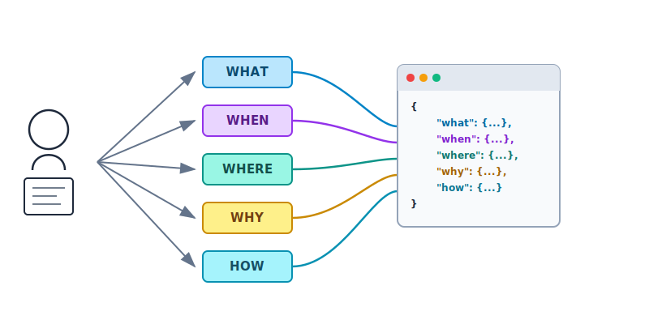
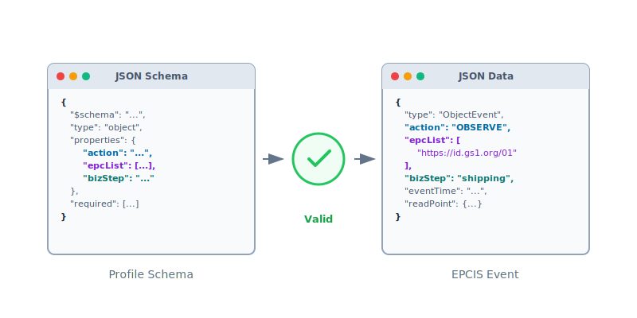

<p align="center">
  <picture>
    <source media="(prefers-color-scheme: dark)" srcset="media/logo-white-circle.svg">
    <source media="(prefers-color-scheme: light)" srcset="media/logo-black-circle.svg">
    
  </picture>
</p>

<h1 align="center">OpenEPCIS Event Sentry</h1>

<p align="center">
  An open-source SDK and web application for validating <a href="https://ref.gs1.org/standards/epcis/">GS1 EPCIS</a> supply chain events against custom business profiles using JSON Schema.
</p>

<p align="center">
  <a href="LICENSE"></a>
  <a href="https://github.com/openepcis/openepcis-event-sentry"></a>
</p>

---

## What is EPCIS?

[EPCIS (Electronic Product Code Information Services)](https://www.gs1.org/standards/epcis) is a GS1 standard for supply chain visibility and traceability. It enables organizations
to capture and share event data in 5 dimensions — WHAT, WHEN, WHERE, WHY and HOW — using a common language across enterprises.

## What is an Event Profile?

An event profile is a set of machine-readable validation rules that define what a compliant EPCIS event must look like. While the EPCIS standard is flexible and open-ended,
businesses and industry associations often need to enforce stricter, agreed-upon rules for data quality and compliance.

Consider a supply chain where there is industry-wide agreement to capture and share EPCIS Shipping Events with downstream trading partners. An industry association could provide an
actionable, machine-readable profile that formally defines the required rules. For example:

- `type` **MUST** be `ObjectEvent`
- `bizStep` **MUST** include either `departing` or `shipping`
- `epcList` **MUST** contain at least one SSCC (Serial Shipping Container Code)
- `readPoint` **MUST** be a GLN (Global Location Number) without extension
- All GS1 identifiers **MUST** be valid GS1 Digital Link URIs
- An extension field (ETA) **MUST** contain a valid date-time value

<details>
<summary>View the corresponding JSON Schema profile</summary>

```json
{
    "$schema": "https://json-schema.org/draft/2020-12/schema",
    "allOf": [
	{
	    "$ref": "https://ref.gs1.org/standards/epcis/epcis-json-schema.json"
	},
	{
	    "type": "object",
	    "properties": {
		"@context": {
		    "contains": {
			"type": "object",
			"properties": {
			    "example": {
				"const": "http://example.com/"
			    }
			},
			"required": [
			    "example"
			]
		    }
		},
		"type": {
		    "const": "EPCISDocument"
		},
		"epcisBody": {
		    "type": "object",
		    "properties": {
			"eventList": {
			    "type": "array",
			    "items": {
				"type": "object",
				"properties": {
				    "type": {
					"type": "string",
					"enum": [
					    "ObjectEvent"
					]
				    },
				    "bizStep": {
					"type": "string",
					"enum": [
					    "departing",
					    "shipping"
					]
				    },
				    "epcList": {
					"type": "array",
					"items": {
					    "type": "string",
					    "pattern": "^https?:\\/\\/([^\\/?#:]+)(:([0-9]*))?(\\/[^?#]*)*\\/00\\/\\d{18}$"
					}
				    },
				    "readPoint": {
					"type": "object",
					"properties": {
					    "id": {
						"type": "string",
						"pattern": "^https?:\\/\\/([^\\/?#:]+)(:([0-9]*))?(\\/[^?#]*)*\\/414\\/\\d{13}(\\/254\\/([a-zA-Z0-9_\".-]|%2[a-cA-CfF15-9]|%3[a-fA-F]){1,20})?$"
					    }
					},
					"required": [
					    "id"
					]
				    },
				    "example:estimatedTimeOfArrival": {
					"type": "string",
					"format": "date-time"
				    }
				},
				"required": [
				    "type",
				    "bizStep",
				    "epcList",
				    "readPoint",
				    "example:estimatedTimeOfArrival"
				],
				"additionalProperties": true
			    }
			}
		    },
		    "required": [
			"eventList"
		    ]
		}
	    },
	    "required": [
		"epcisBody",
		"type"
	    ],
	    "additionalProperties": true
	}
    ]
}
```

</details>

Following is the corresponding EPCIS Document generated using [OpenEPCIS Test Data Generator](https://tools.openepcis.io/ui/event-data-generator) that matches the above profile:

<details>
<summary>View the corresponding EPCIS Document</summary>

```json
{
    "@context": [
	{
	    "example": "http://example.com/"
	},
	"https://ref.gs1.org/standards/epcis/epcis-context.jsonld"
    ],
    "type": "EPCISDocument",
    "schemaVersion": "2.0",
    "creationDate": "2026-04-02T12:43:58.63Z",
    "epcisBody": {
	"eventList": [
	    {
		"type": "ObjectEvent",
		"eventTime": "2026-04-02T14:42:36+02:00",
		"eventTimeZoneOffset": "+02:00",
		"epcList": [
		    "https://id.gs1.org/00/092567800000000018"
		],
		"action": "OBSERVE",
		"bizStep": "shipping",
		"readPoint": {
		    "id": "https://id.gs1.org/414/9520123456788"
		},
		"example:estimatedTimeOfArrival": "2026-04-02T14:30:00Z"
	    }
	]
    }
}
```
</details>

This is exactly the type of use case the EPCIS Profile Checker is designed to support. It enables industry associations to define such profiles in a machine-readable form
using [JSON Schema](https://json-schema.org/), and allows these rules to be consistently enforced through automated validation.

Any member of the supply chain can use the same profile to independently verify whether their events comply with the agreed rules — before sharing them with trading partners. The
result is:

- Higher and more consistent **data quality**
- Significantly reduced **manual validation effort**
- Faster **onboarding** and shorter time to market for new partners

## Features

### SDK

- **Validate events** against custom JSON Schema profiles using [AJV](https://ajv.js.org/)
- **Detect document types** — EPCISDocument or bare events
- **Type checking utilities** — verify event types (ObjectEvent, AggregationEvent, TransactionEvent, TransformationEvent, AssociationEvent)
- **Profile rule schemas** — built-in schemas for profile detection and validation rules
- **Dual build targets** — works in both Node.js and browser environments

### Web Application

A full-featured web UI is available as [Web Application](https://profile-checker.openepcis.io/) or source code
at [openepcis-snippet-web](https://github.com/openepcis/openepcis-snippet-web):

<table>
  <tr>
    <td align="center" width="33%">
      <picture>
        <source media="(prefers-color-scheme: dark)" srcset="media/profile-builder-dark.svg">
        <source media="(prefers-color-scheme: light)" srcset="media/profile-builder-light.svg">
        
      </picture><br>
      <b>Profile Builder</b><br>
      <sub>Visually create JSON Schema profiles for EPCIS document/event validation</sub>
    </td>
    <td align="center" width="33%">
      <picture>
        <source media="(prefers-color-scheme: dark)" srcset="media/event-validator-dark.svg">
        <source media="(prefers-color-scheme: light)" srcset="media/event-validator-light.svg">
        
      </picture><br>
      <b>Event Validator</b><br>
      <sub>Validate EPCIS events against profiles with instant compliance feedback</sub>
    </td>
    <td align="center" width="33%">
      <picture>
        <source media="(prefers-color-scheme: dark)" srcset="media/snippet-search-dark.svg">
        <source media="(prefers-color-scheme: light)" srcset="media/snippet-search-light.svg">
        
      </picture><br>
      <b>Snippet Search</b><br>
      <sub>Search and filter reusable EPCIS event snippets from the library</sub>
    </td>
  </tr>
</table>

## Getting Started

### Run the Web App with Docker / Podman

The quickest way to get started. Pull and run the pre-built container:

```bash
# Docker
docker pull ghcr.io/openepcis/openepcis-snippet-web:latest
docker run -p 3000:3000 ghcr.io/openepcis/openepcis-snippet-web:latest

# Podman
podman pull ghcr.io/openepcis/openepcis-snippet-web:latest
podman run -p 3000:3000 ghcr.io/openepcis/openepcis-snippet-web:latest
```

Open [http://localhost:3000](http://localhost:3000) in your browser.

**With Docker Compose:**

```yaml
services:
  openepcis-snippet-web:
    image: ghcr.io/openepcis/openepcis-snippet-web:latest
    ports:
      - "3000:3000"
    environment:
      - NUXT_PUBLIC_SNIPPET_API_URL=https://api.epcis.cloud
    restart: unless-stopped
```

```bash
docker-compose up -d
```

For more Docker options and environment variables, see the [openepcis-snippet-web](https://github.com/openepcis/openepcis-snippet-web) repository.

### Run the Web App from Source

Requires [Node.js](https://nodejs.org/) 18+ and [pnpm](https://pnpm.io/).

```bash
git clone https://github.com/openepcis/openepcis-snippet-web.git
cd openepcis-snippet-web
pnpm install
pnpm dev

```

Open [http://localhost:3000](http://localhost:3000) in your browser.

## Examples

The [`examples/`](examples/) directory contains paired EPCIS events and their corresponding validation profiles:

- `epcis-events/` — Sample EPCIS event documents
- `epcis-profiles/` — Matching JSON Schema profiles for validation

The [`json-schema-epcis-snippets/`](json-schema-epcis-snippets/) directory contains reusable JSON Schema components for building custom profiles.

## Contributing

We welcome contributions! Here are ways to get involved:

- **Bug Reports** — identify and report issues
- **Feature Requests** — suggest improvements
- **Pull Requests** — submit code changes or new profiles
- **Documentation** — help improve guides and examples

Please review the [Code of Conduct](codeOfConduct.md) before contributing.

## License

[Apache License 2.0](LICENSE)
